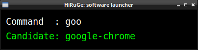

HiRuGe - software launcher for Linux
================================================================================

X11-based simple software launcher with auto command complete.

<div align="center">
   
</div>


Install
--------------------------------------------------------------------------------

You can build HiRuGe from source code by the following command:

```shell
# Install necessary tools to build.
apt install g++ make libx11-dev libxft-dev libfreetype-dev

# Build.
make
```


Usage
--------------------------------------------------------------------------------

Execute HiRuGe binary and type a name of command which you want to launch
and hit enter. Then the command you'be typed will be called.


Customize
--------------------------------------------------------------------------------

You can customize HiRuGe by creating a config file and modify it appropriately.
Currently you can customize the following items:

* Size of the main window,
* Border width of the main window,
* Window title.
* Text position,
* Font name and size,

### Create your config file

Before you start customizing HiRuGe, please create your config file.

```shell
# Create a config directory for HiRuGe.
mkdir -p ~/.config/hiruge

# Create a new config file.
cp ~/.config.toml ~/.config/hiruge
```


Licence
--------------------------------------------------------------------------------

[MIT Licence](https://opensource.org/licenses/mit-license.php)


